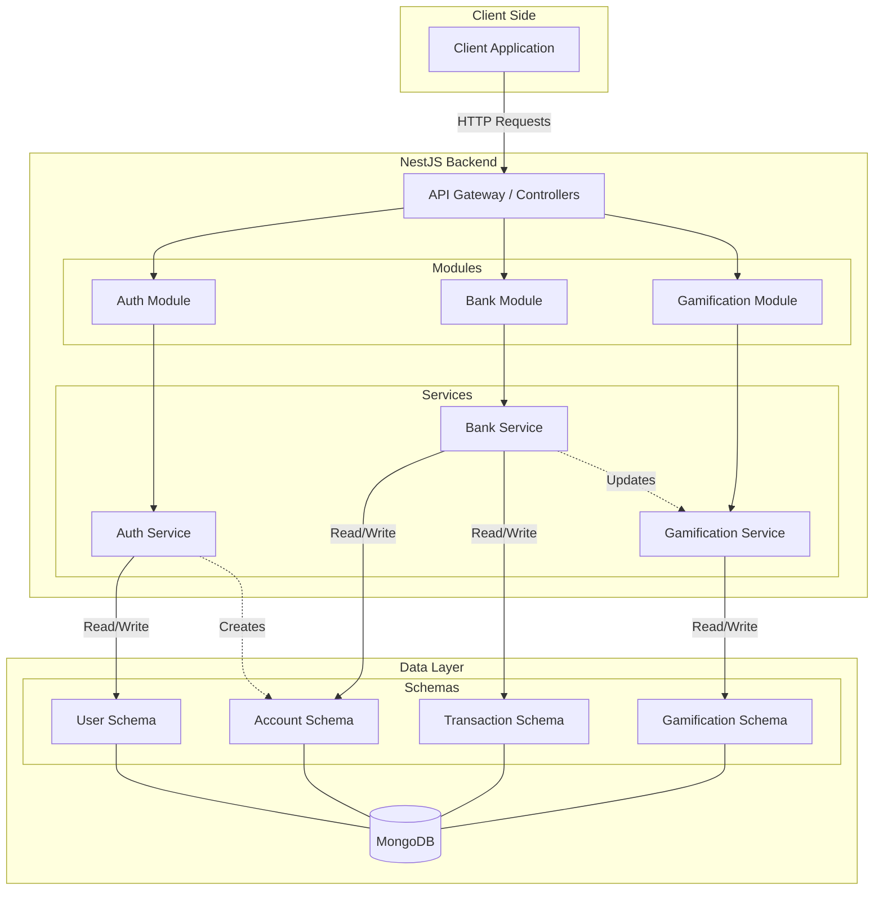

# System Architecture: Gamified Digital Bank Backend

This document provides a high-level overview of the system architecture for the Gamified Digital Bank Backend.

## High-Level Architecture

The application is built using **NestJS**, a progressive Node.js framework, and uses **MongoDB** as the database. It follows a modular architecture, separating concerns into distinct modules for Authentication, Banking, and Gamification.

## Component Breakdown

### 1. Core Framework
-   **NestJS**: The main framework used for building the server-side application.
-   **Mongoose**: An Object Data Modeling (ODM) library for MongoDB and Node.js.

### 2. Modules
The application is divided into three main feature modules:

#### **Auth Module** (`src/auth`)
-   **Purpose**: Handles user authentication and authorization.
-   **Key Components**:
    -   `AuthController`: Manages authentication endpoints (login, register).
    -   `AuthService`: Implements authentication logic using **Better-Auth**.
    -   `User Schema`: Defines the user data structure.

#### **Bank Module** (`src/bank`)
-   **Purpose**: Manages core banking operations.
-   **Key Components**:
    -   `BankController`: Handles banking-related HTTP requests.
    -   `BankService`: Contains business logic for accounts and transactions.
    -   `Account Schema`: Defines bank account details (balance, account number).
    -   `Transaction Schema`: Records financial transactions (deposits, transfers).

#### **Gamification Module** (`src/gamification`)
-   **Purpose**: Adds gamified elements to the banking experience.
-   **Key Components**:
    -   `GamificationController`: Manages gamification endpoints.
    -   `GamificationService`: Logic for points, levels, and rewards.
    -   `Gamification Schema`: Stores user progress and gamification data.

### 3. Data Layer
-   **MongoDB**: The primary database used to store all application data.
-   **Schemas**: Mongoose schemas define the shape of documents within the collections.

## External Services
-   **Vercel**: The platform used for deployment and hosting (`vercel.json`, `src/vercel.ts`).
